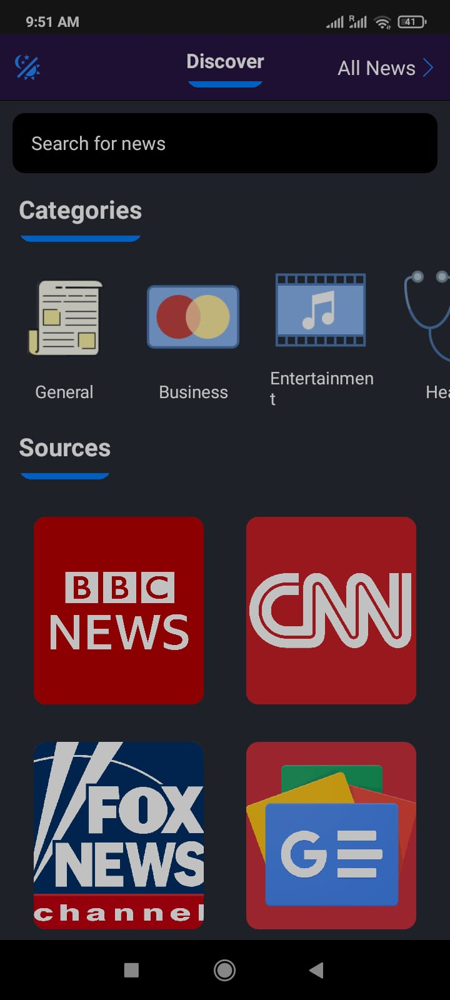

#  NewzCloud

News app will fetch the latest news from around the globe and display it to the users.It will provide headlines and details in the form of the Feed which will refresh and get the latest and most updated news. This app will get the news from multiple sources and news channels such as CNN, BBC. This app will also give users an option to select from the different categories of news.

## Table of Contents

* [Audience](#audience)
* [Contents - Features](#contents-features)
* [Requirements](#Requirements)
* [Technology Stack used in App](#technology-stack-used-in-app)
* [Building React Native NewzCloud app](#building-react-native-newzCloud-app)
* [Documentation](#documentation) 
  * [Installation Steps](#installation-steps) 
  * [Scripts for execution of the app](#scripts-for-execution-of-the-app) 
  * [Folder structure](#folder-structure)
* [Application screenshots and steps to use the app](#application-screenshots-and-steps-to-use-the-app)
* [Design Patterns in App](#design-patterns-in-app)
* [Contributors](#Contributors)
 

## 🤳 Audience 

This app will attract the audience from all age groups who are interested in reading news from all around the world. It will cater to the needs of the audience by
also providing categories feature where one can select the category of the news in which they are most interested.

##  👨‍💻 Contents - Features

**Search for news items:** Search bar is provided to search for particular news items.

**News tab:** One can keep scrolling for the latest news and it will appear as the feed and it will refresh as the user slides the screen.

**Read More Option:** Read More about the News option is provided which takes the user to the original source of the news that means the user is redirected
to the website from where the news is fetched.

**Categories:**  News can be based on different categories such as Education, Business, World Politics, Economics.

## 📋 Requirements

✍️ **Non functional requirements:**

**Performance :** This is a light weighted app which fetches the data from different sources and consumes the APIs. We did a performance testing to check if multiple users are using the app simultaneously. And in the results we found that the app can be used by the several users simultaneoulsy.

**Security:** This app is not storing any personalised data of the user as of now and therefore, we did not plan to implement the database security. However, certain validations and testing parameters are placed to make sure that the app is secure and the privacy of the user is maintained.

**Future Scope:** Certain features can be added to the app in the future which were not considered in the current scope of this project are mentioned below.
Future Prospects or features that can be integrated:
● Weather forecast.
● News depending on the location of the user.
● Adding comments.
● Personalised feeds.

## 💻 Technology Stack used in App
React-Native is used for the development of NewzCloud mobile application. This application interacts with the several external APIs through REST API calls and consumes the data from various sources to display the latest news to the user.AXIOS is also used in this app which is a lightweight HTTP client based on the $http service and it is used for fetching the data.

NewzCloud mobile application is using third-party APIs to fetch the latest news and the main third-party APIs with which this app interacts is as mentioned below:
### Wikimedia
### Bankimooncenter

## 🎉 Building React Native NewzCloud app

## 📖 Documentation

For executing the application below steps needs to be followed:

## 🛠️ Installation Steps

1. Install node js on your system
3. Install expo client
4. You can use VS code as the IDE for viewing the code and making the code changes
5. Clone the repository
6. Change the working directory
7. Install dependencies: npm install
8. Run the app: npm start

## Scripts for execution of the app
### `npm start`

Runs your app in development mode.

### `expo start`

Runs your app in development mode.

1. expo start - On execution of this command it will bundle all the libraries and resources and generate the QR code and a URL.
2. Scan the QR code on your android or iOs device which has the expo app installed.
3. After scanning the NewzCloud app will load and the user can start using the application.

## Folder structure
This project follows a simple and elegant project structure according to the industry standards. The project structure is shown below:
 
  - `API`: This folder contains actions and the js file.
  - `assets`: This folder stores all images used in the project.
  - `components`: This folder stores components used in the project.
	  - `CloudNavigation.js`
      - `CloudNews.js`
	  - `CloudSearch.js`
      - `NewzCloudTabs.js`
  - `images`: This folder conatins screenshots of all the main components and screens after the app is executed on an Android device.
  - `Screens`: This folder contains all the application screens/features.
      - `Discover.js`
      - `NewsScreen.js`
  - `App.js`: This is the main file inside our application from where the execution of the project starts.

## Application screenshots and steps to use the app
### Screenshots: 📷
Step 1: When the NewzCloud application is loaded the user will be able to see the News feed and they can scroll to get the latest news update from all over the world as shown on the screen shot below: 

Step 2: User can click on the "Discover" on the top-left corner and click on it. After clicking on Discover below screen will appear: 

Step 3: Categories: User can view the news on the choice of the Categories. The various categories provided in the News app are General, Business, Entertainment and they are shown below: 

Step 4: Swipe on the right side to view more categories Health, Science, Sports, Technology 

Step 5: By clicking on these Categories of news, user will be redirected to that category of news. For example, by clciking on Science user will be taken to news of Science category. 

Step 6: After the user makes the selection based on the category, user also has the option to view the News based on the News Channel. User will be redirected to News Channel specific news.
For Example: When user clicks on BBC news he will be shown news fetched from BBC news as shown in the screenshot below. 

## Design Patterns in App

1. We started building our app with the presenatational components and as the development evolved we started adding components and screens to the application.
2. After sometime we realised that alot of props were passed down to the line to the intermediate components.
3. Then we planned to introduce controller components in our app. This way we got the behaviour and other props to the end components without affecting the intermediary components.
4. We ended up using **Container-View pattern** which is an efficient and effective way to build react-native mobile application.
5. **Container component** act as the entry point and is responsible for getting the data and calling the required business logic for performing all the logical and necessary operations.
6. **View Component** act as the component that comprises of all the View related components and is responsible for design, look and feel and over all view of the application along with the StyleSheets added to these components. All the logic related to presenatation is added to the View component of the application.

## Contributors
### Raghav Sharma 
### Neha Garg 

